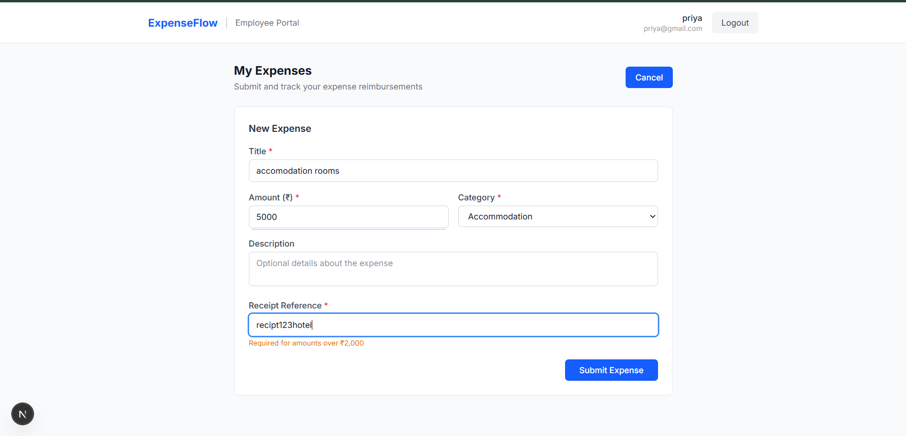
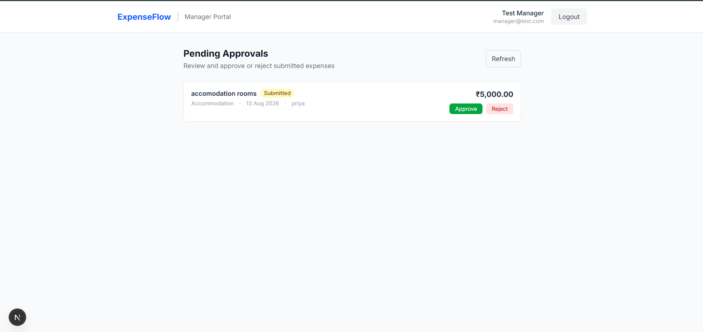
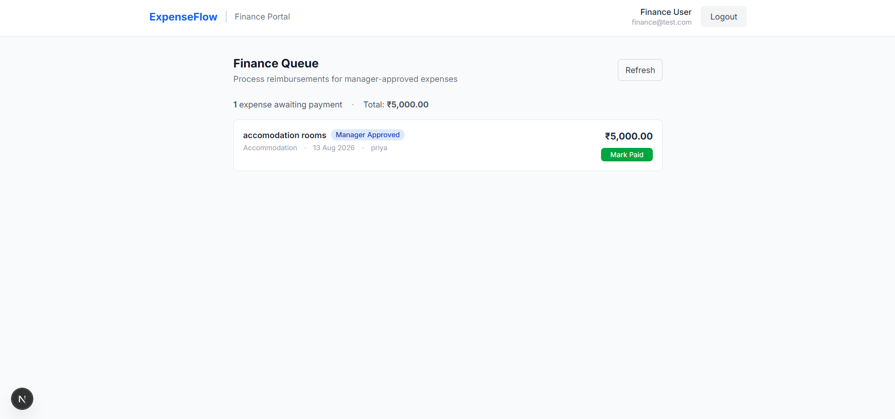

# ExpenseFlow

## Expense Approval & Reimbursement System

ExpenseFlow is a full-stack application built to simplify the way organizations handle expense approvals and reimbursements.

The idea behind this project came from a simple observation: expense approval usually involves multiple people, manual follow-ups, and difficulty tracking the current status of a request.

ExpenseFlow solves this by providing a clear digital workflow where:

- Employees can submit expenses
- Managers can review and approve/reject requests
- Finance teams can complete reimbursements

This project was developed as part of the **Tactive AI-Powered QA Automation & Software Engineering Assessment**. Along with building the application, I focused on creating a complete engineering workflow involving AI-assisted development, automated testing, debugging, and documentation.


# How ExpenseFlow Works

The complete expense journey follows this flow:

```
Employee submits expense
          ↓
Manager reviews request
          ↓
Approve / Reject
          ↓
Finance processes payment
          ↓
Expense completed
```


# Main Features

## Employee

Employees can:

- Create an account and login
- Submit new expense requests
- View submitted expenses
- Track approval status
- Cancel pending expenses


## Manager

Managers can:

- View employee expense requests
- Review expense details
- Approve or reject expenses


## Finance

Finance users can:

- View manager-approved expenses
- Process reimbursements
- Mark expenses as paid


# Tech Stack

The application was built using technologies that support a clean and maintainable full-stack architecture.


## Frontend

- Next.js
- TypeScript
- Tailwind CSS


## Backend

- Java 17
- Spring Boot
- Spring Security
- JWT Authentication
- Spring Data JPA


## Database

- PostgreSQL


## Testing

- JUnit 5
- Mockito
- Spring Boot Test


# Application Architecture

ExpenseFlow follows a layered architecture where each part of the application has a clear responsibility.

```
Frontend (Next.js)
        |
        |
     REST API
        |
        |
Backend (Spring Boot)

Controller
     |
Service
     |
Repository
     |
PostgreSQL
```

This separation keeps the application easier to maintain and allows business logic, API handling, and database operations to remain independent.


# Security

Security was an important part of the implementation.

The application includes:

- JWT-based authentication
- Role-based authorization
- BCrypt password encryption
- Request validation
- Centralized exception handling

Users can only access features allowed for their assigned role.

# Prerequisites

Before running ExpenseFlow locally, make sure the following are installed:

### Required Software

- **Java 17 or higher**
  - Required for running the Spring Boot backend

- **Maven**
  - Used for backend dependency management and running tests

- **Node.js (v18 or higher recommended)**
  - Required for running the Next.js frontend

- **PostgreSQL**
  - Used as the application database


### Verify Installation

Check the installed versions:

```bash
java -version

mvn -version

node -version

psql --version

Database Setup
Create a PostgreSQL database:
expenseflow

Configure your database credentials in:
backend/src/main/resources/application-example.properties
(If you are setting up the project for the first time:
1. Copy the example configuration:
application-example.properties
to:
application.properties
2. Update PostgreSQL username, password, and JWT secret values.)
Start the backend server first, followed by the frontend application.


# Running the Application Locally

## Backend Setup

Run:

```bash
cd backend
mvn spring-boot:run
```

Backend runs at:

```
http://localhost:8080
```


## Frontend Setup

Requirements:

- Node.js


Run:

```bash
cd frontend
npm install
npm run dev
```

Frontend runs at:

```
http://localhost:3000
```


# Testing

Automated tests were created to verify important application workflows.

The test suite covers:

- User authentication
- Expense creation
- Validation rules
- Approval workflow
- Payment workflow
- Authorization rules


Run tests:

```bash
cd backend
mvn test
```


Final test result:

```
Tests run: 19
Failures: 0
Errors: 0

BUILD SUCCESS
```


I also verified that the test suite could detect real issues by intentionally introducing a workflow bug, observing the failure, fixing it, and running the tests again successfully.

Detailed evidence:

```
submission/docs/ai-change-loop.md
submission/docs/test-report.md
```


# AI-Assisted Development

AI tools were used as engineering assistants throughout this project.

They helped with:

- Understanding the codebase
- Implementing changes
- Writing and improving tests
- Debugging issues
- Preparing documentation

All final technical decisions, code reviews, and validations were performed manually.


## Tools Used


### Google Antigravity

Used for:

- Repository analysis
- Feature implementation support
- Test generation
- Failure analysis


### Cursor

Used for:

- Reviewing code changes
- Checking differences
- Making small corrections


### ChatGPT

Used for:

- Architecture discussions
- Prompt improvement
- Documentation planning


The workflow followed:

```
Understand Requirement

        ↓

Analyse using AI

        ↓

Implement Feature

        ↓

Run Tests

        ↓

Identify Issues

        ↓

Fix

        ↓

Verify
```


# Documentation

The assessment documentation is available here:

submission/docs/

├── architecture.md
├── design-document.md
├── user-guide.md
├── requirements.md
├── ai-change-loop.md
├── ai-tools-used.md
└── test-report.md

# Application Screenshots

## Employee Dashboard



## Expense Approval Flow



## Finance Payment


# Future Improvements

Some improvements I would add in future versions:

- Email notifications
- Receipt file upload support
- Cloud deployment
- CI/CD pipeline integration
- Expense analytics dashboard


# Final Thoughts

Building ExpenseFlow helped me understand how AI tools can be integrated into a real software engineering workflow.

The goal was not only to generate code faster, but to use AI responsibly — understand problems, implement solutions, test changes, debug failures, and deliver a reliable application.