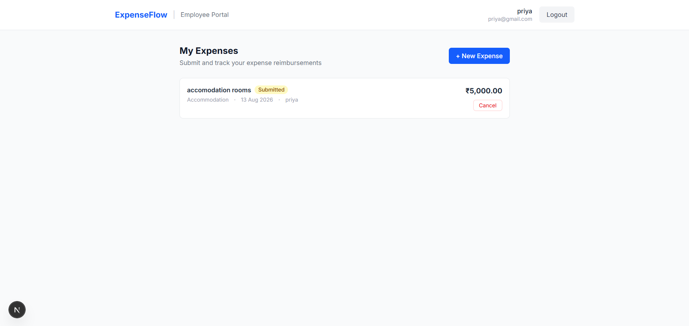

# ExpenseFlow

Expense Approval & Reimbursement System

ExpenseFlow is a full-stack expense management application that simplifies the process of submitting, reviewing, approving, and reimbursing employee expenses.

The idea behind this project came from a common workplace challenge — expense approval usually involves multiple people, manual tracking, and unclear status updates. ExpenseFlow provides a structured workflow where employees can submit expenses, managers can review requests, and finance teams can complete reimbursements in one place.

This project was developed as part of the **Tactive AI-Powered QA Automation & Software Engineering Assessment**. Along with building the application, I focused on using AI tools throughout the engineering lifecycle — from understanding the codebase and implementing features to testing, debugging, and documentation.

---

# Table of Contents

- [Overview](#overview)
- [Features](#features)
- [Technology Stack](#technology-stack)
- [Application Architecture](#application-architecture)
- [Expense Workflow](#expense-workflow)
- [Security](#security)
- [Prerequisites](#prerequisites)
- [Running the Application](#running-the-application)
- [Testing](#testing)
- [AI-Assisted Development](#ai-assisted-development)
- [Documentation](#documentation)
- [Evidence](#evidence)
- [Verification Checklist](#verification-checklist)
- [Future Improvements](#future-improvements)
- [Final Thoughts](#final-thoughts)

---

# Overview

ExpenseFlow manages the complete expense reimbursement lifecycle.

The system supports three types of users:

## Employee

Employees can:

- Create an account and login
- Submit expense requests
- View their submitted expenses
- Track approval status
- Cancel pending expenses


## Manager

Managers can:

- View employee expense requests
- Review expense details
- Approve or reject expenses


## Finance

Finance users can:

- View manager-approved expenses
- Process reimbursements
- Mark expenses as paid

---

# Features

## Authentication

- User registration
- Secure login
- JWT-based authentication
- Role-based authorization
- Password encryption using BCrypt


## Expense Management

- Create expense requests
- View expense history
- Validate expense rules
- Track expense status


## Approval Workflow

- Manager approval/rejection
- Finance payment processing
- Status tracking


## Business Rules

Implemented validations:

- Expense amount must be greater than ₹0
- Expenses above ₹2,000 require receipt reference
- Maximum expense limit is ₹1,00,000
- Users can only access permitted actions based on roles
- Managers cannot approve their own expenses

---

# Technology Stack

## Frontend

- Next.js
- TypeScript
- Tailwind CSS


## Backend

- Java 17
- Spring Boot
- Spring Security
- JWT Authentication
- Spring Data JPA


## Database

- PostgreSQL


## Testing

- JUnit 5
- Mockito
- Spring Boot Test

---

# Project Structure

The repository is organized into separate folders for application code, documentation, and assessment evidence.
```text
tactive_assesment/
│
├── backend/
│ ├── src/
│ │ ├── main/
│ │ │ ├── java/com/tactive/expense/
│ │ │ │ ├── controller/
│ │ │ │ ├── service/
│ │ │ │ ├── repository/
│ │ │ │ ├── entity/
│ │ │ │ └── security/
│ │ │ └── resources/
│ │ └── test/
│ │
│ └── pom.xml
│
├── frontend/
│ ├── app/
│ ├── components/
│ ├── public/
│ └── package.json
│
├── submission/
│ │
│ ├── docs/
│ │ ├── architecture.md
│ │ ├── design-document.md
│ │ ├── user-guide.md
│ │ ├── requirements.md
│ │ ├── ai-change-loop.md
│ │ ├── ai-tools-used.md
│ │ └── test-report.md
│ │
│ ├── screenshots/
│ │ ├── application/
│ │ ├── ai-loop/
│ │ ├── database/
│ │ └── tests/
│ │
│ └── Presentation_deck/
│ └── ExpenseFlow-Presentation.pptx
│
├── README.md
└── .gitignore
```

# Application Architecture

ExpenseFlow follows a layered full-stack architecture.

```
              User Browser

                   |
                   |

          Next.js Frontend

                   |
                   |

             REST API

                   |
                   |

          Spring Boot Backend

                   |

        -------------------

        Controller Layer

               |

        Service Layer

               |

        Repository Layer

               |

          PostgreSQL Database
```

### Backend Flow

```
Controller
    |
    |
 Service
    |
    |
 Repository
    |
    |
 Database
```

This separation keeps API handling, business logic, and database operations independent and easier to maintain.

---

# Expense Workflow

The complete expense lifecycle:

```
Employee submits expense

          ↓

       SUBMITTED

          ↓

Manager reviews request

      ↙          ↘

 REJECTED     MANAGER_APPROVED

                    ↓

              Finance Review

                    ↓

                  PAID
```

Expense statuses:

| Status | Meaning |
|---|---|
| SUBMITTED | Waiting for manager review |
| MANAGER_APPROVED | Approved and waiting for payment |
| REJECTED | Expense rejected by manager |
| PAID | Payment completed |

---

# Security

Security was an important part of this project.

Implemented:

- JWT authentication
- Role-based access control
- BCrypt password hashing
- Request validation
- Centralized exception handling


Each user can only perform actions allowed for their role.

---

# Prerequisites

Before running ExpenseFlow, install:

- Java 17+
- Maven
- PostgreSQL
- Node.js


Verify installations:

```bash
java -version
mvn -version
node -v
npm -v
```

---

# Environment Configuration

Sensitive information is not committed to the repository.

Create:

```
backend/src/main/resources/application.properties
```

Example:

```properties
spring.datasource.url=your_database_url
spring.datasource.username=your_username
spring.datasource.password=your_password

jwt.secret=your_secret_key
```

A sample configuration file is available:

```
backend/src/main/resources/application-example.properties
```

---

# Running the Application

## Backend

Navigate to backend:

```bash
cd backend
```

Run:

```bash
mvn spring-boot:run
```

Backend runs on:

```
http://localhost:8080
```

---

## Frontend

Navigate to frontend:

```bash
cd frontend
```

Install dependencies:

```bash
npm install
```

Start application:

```bash
npm run dev
```

Frontend runs on:

```
http://localhost:3000
```

---
---

# API Overview

The backend exposes REST APIs for authentication and expense management.
```md
## Authentication
```http
POST /auth/register
POST /auth/login


## Expense APIs


POST /expenses
GET /expenses
PUT /expenses/{id}/approve
PUT /expenses/{id}/reject
PUT /expenses/{id}/pay


Protected APIs require:


Authorization: Bearer <JWT_TOKEN>

```

# Testing

Automated tests were created to validate important workflows.

Covered areas:

- User authentication
- Expense creation
- Validation rules
- Approval workflow
- Payment workflow
- Authorization checks


Run tests:

```bash
cd backend

mvn test
```

Final result:

```
Test Summary:

Total Tests: 19
Passed: 19
Failed: 0
Errors: 0

BUILD SUCCESS

```

A deliberate failure test was also performed by introducing a workflow defect and verifying that the automated tests detected the issue before fixing it.

More details:

```
submission/docs/ai-change-loop.md

submission/docs/test-report.md
```

---

# AI-Assisted Development

AI tools were used as engineering assistants throughout this project.

The goal was not only to accelerate development, but also to improve analysis, testing, debugging, and documentation quality.

## Google Antigravity

Used for:

- Understanding the existing codebase
- Analysing project structure
- Implementing feature changes
- Generating tests
- Running and analysing test results


## Cursor

Used for:

- Reviewing code changes
- Inspecting diffs
- Making small corrections


## ChatGPT

Used for:

- Architecture discussions
- Requirement analysis
- Prompt improvement
- Documentation planning


The workflow followed:

```
Requirement

     ↓

AI Analysis

     ↓

Implementation

     ↓

Testing

     ↓

Failure Detection

     ↓

Fix

     ↓

Verification
```

All AI-generated changes were reviewed and validated before being included.

---

# Documentation

Detailed project documentation is available:

```
submission/docs/

├── architecture.md
├── design-document.md
├── user-guide.md
├── requirements.md
├── ai-change-loop.md
├── ai-tools-used.md
└── test-report.md
```

---

# Evidence

The repository contains evidence from the development and testing process.

Included:

- Application screenshots
- AI analysis screenshots
- Code change screenshots
- Test execution results
- Deliberate failure test results


Location:

```
submission/screenshots/
```

---

# Verification Checklist

| Component | Status |
|---|---|
| Frontend application | ✅ |
| Backend application | ✅ |
| Database integration | ✅ |
| JWT Authentication | ✅ |
| Role-based authorization | ✅ |
| Expense submission | ✅ |
| Manager approval flow | ✅ |
| Finance payment flow | ✅ |
| Business validations | ✅ |
| Automated tests | ✅ |
| AI Change Loop | ✅ |
| Documentation | ✅ |

---
---

# Application Screenshots

## Employee Dashboard


## Expense Submitted




## Manager Approval


## Finance Payment


---

# Future Improvements

If I continue improving ExpenseFlow, I would add:

- Email notifications
- Receipt file uploads
- Cloud deployment
- CI/CD pipeline
- Expense analytics dashboard
- Automated report generation

---

# Final Thoughts

Building ExpenseFlow helped me understand how AI tools can be integrated into a real software engineering workflow.

The focus was not just generating code faster, but using AI responsibly — understanding requirements, making design decisions, implementing features, testing solutions, finding failures, and verifying the final result.

ExpenseFlow represents a complete build → test → debug → improve engineering cycle with AI assistance.